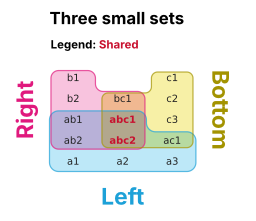

# Render


<!-- WARNING: THIS FILE WAS AUTOGENERATED! DO NOT EDIT! -->

Each set is drawn as the union of its cells, shrunk slightly so
overlapping outlines don’t sit on top of each other, with rounded
corners. Zones are filled by multiplying light cyan, magenta and yellow
tints, as if they were overlapping inks. Names are drawn as live text,
so SVG and PDF output stays editable in Illustrator or Inkscape.

------------------------------------------------------------------------

<a
href="https://github.com/adamcc/itemiset/blob/main/itemiset/render.py#L33"
target="_blank" style="float:right; font-size:smaller">source</a>

### multiply

``` python
def multiply(
    colours
)->tuple:
```

*Multiply colours like overlapping inks: cyan × magenta = lavender, and
so on.*

``` python
[to_hex(multiply([SET_COLOURS[i][0] for i in combo]))
 for k in (1, 2, 3) for combo in combinations(range(3), k)]
```

    ['#bde8f8', '#f8c3de', '#f7f0a6', '#b8b1d8', '#b7daa1', '#f0b891', '#b2a78d']

------------------------------------------------------------------------

<a
href="https://github.com/adamcc/itemiset/blob/main/itemiset/render.py#L62"
target="_blank" style="float:right; font-size:smaller">source</a>

### render

``` python
def render(
    lay:itemiset.layout.Layout, out:NoneType=None, categories:NoneType=None, cat_colours:NoneType=None,
    title:NoneType=None, cell_w_in:NoneType=None, cell_h_in:float=0.19, fontsize:float=6.5, outline:bool=True,
    dpi:int=300, corner:float=0.48, legend:bool=True
)->matplotlib.figure.Figure:
```

*Draw `lay` as a matplotlib `Figure`, and save it to `out` (.png, .pdf
or .svg) if given.*

## [`plot`](https://adamcc.github.io/itemiset/render.html#plot): sets in, figure out

------------------------------------------------------------------------

<a
href="https://github.com/adamcc/itemiset/blob/main/itemiset/render.py#L186"
target="_blank" style="float:right; font-size:smaller">source</a>

### plot

``` python
def plot(
    sets:dict, out:NoneType=None, categories:NoneType=None, category_colours:NoneType=None, show_empty:bool=False,
    bottom:NoneType=None, title:NoneType=None, target_aspect:float=2.2, fontsize:float=6.5, zones_out:NoneType=None,
    verbose:bool=False, **render_kw
)->itemiset.layout.Layout:
```

*Lay out and draw 1–3 sets given as `{name: [items]}`. Returns the
[`Layout`](https://adamcc.github.io/itemiset/layout.html#layout); its
figure is `.fig`.*

A layout shows its figure when it’s the last thing in a notebook cell:

``` python
demo = {"Left":   ["a1", "a2", "a3", "ab1", "ab2", "ac1", "abc1", "abc2"],
        "Right":  ["b1", "b2", "ab1", "ab2", "bc1", "abc1", "abc2"],
        "Bottom": ["c1", "c2", "c3", "ac1", "bc1", "abc1", "abc2"]}
lay = plot(demo, categories={"abc1": "Shared", "abc2": "Shared"}, title="Three small sets", verbose=True)
lay
```

    Roles: A=Right, B=Bottom, C=Left | group widths (L, M, R): (1, 1, 1)
      Left                                              3
      Right                                             2
      Bottom                                            3
      Left ∩ Right                                      2
      Right ∩ Bottom                                    1
      Left ∩ Bottom                                     1
      Left ∩ Right ∩ Bottom                             2



Output format follows the file extension. In SVG the names stay as text:

``` python
tmp = Path(tempfile.mkdtemp())
for ext in ("png", "pdf", "svg"):
    plot(demo, out=tmp/f"demo.{ext}")
    assert (tmp/f"demo.{ext}").stat().st_size > 1000
svg = (tmp/"demo.svg").read_text()
assert ">abc1</text>" in svg  # live text, not outlines
```
